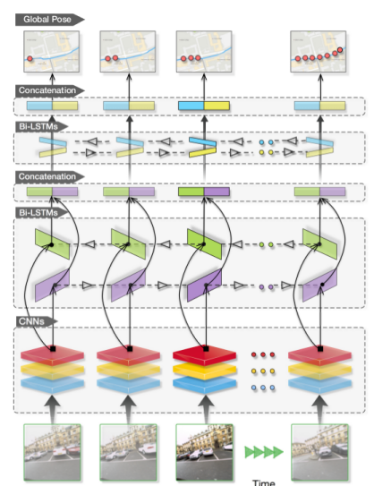
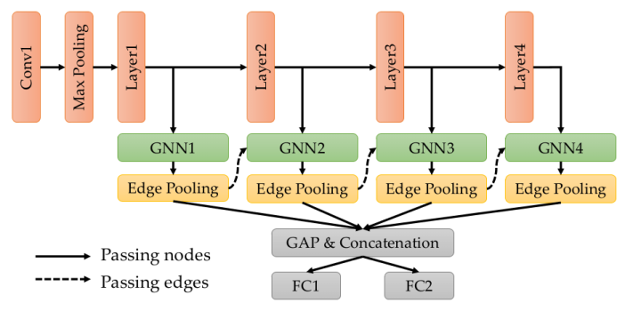

Title: Learning Multi-view Camera Relocalization with Graph Neural Networks
Date: 2021-01-13 13:00
Modified: 2021-01-13 13:00
Category: Machine learning
Tags: deep-learning, computer-vision
Slug: multi-view-reloc
Authors: Frithjof Winkelmann
Summary: Paper analysis of "Learning Multi-view Camera Relocalization with Graph Neural Networks"

<link rel="stylesheet"  href="{filename}../style.css">

This blog post will review the paper
[Learning Multi-view Camera Relocalization with Graph Neural Networks](https://openaccess.thecvf.com/content_CVPR_2020/html/Xue_Learning_Multi-View_Camera_Relocalization_With_Graph_Neural_Networks_CVPR_2020_paper.html)
presented at CVPR 2020. I will cover related literature,
explain the methodology and offer my own view at the end.

Note: This blog post has several expandable sections. They are not required
for understanding the paper, but contain further information for
the interested reader.

## Terminology

This section clarifies a few concepts that are needed to
understand camera re-localization. If you are already experienced
in computer vision you can probably skip it.

  
Poses

  A pose describes the position and orientation of
  an object in 3D space. It consists of a translational
  component $\vec{t} \in \mathbb{R}^3$ and a orientational
  component, often represented as a quaternion $q \in \mathbb{H}$.

  A 3D pose can also be described by a matrix
  $$
  p \in \mathbb{R}^{4 \times 4} = \begin{pmatrix} R & \vec{t} \\ \vec{0} & 1\end{pmatrix}
  $$
  where $R \in \mathbb{R}^{3 \times 3}$ is a rotation matrix (so $det\ R = 1$)
  and $\vec{t}$ is the translation vector.

  The set of all possible matrices representing a valid pose in
  3D is often written $SE(3)$.

  These matrices act on vectors in homogeneous coordinates, where we write
  a position in 3D space $x \in \mathbb{R}^3$ as a 4 dimensional vector
  $$
  \bar{x} = \begin{pmatrix}
    x_1 \\ x_2 \\ x_3 \\ 1
  \end{pmatrix}
  $$
  This allows the translation to be expressed in the matrix as well (while
  in non-homogeneous coordinates it can not be expressed in a matrix since it is not linear).

## Camera Re-localization

Camera re-localization is the of task finding your position
in a known environment only by observation through pictures.
Humans do this constantly - when you get out of the subway
and want to find the exit thats closest to your destination
or when you make your daily way to work from memory.

This is also a fundamental step in many computer vision tasks.
To be more specific, camera re-localization is the task
of finding the absolute pose $p_q \in SE(3)$ of a query image
$i_q \in \mathbb{R}^{3 \times W \times H}$ (with width $W$ and
height $H$) given a **database** of images $I = \{i_1, ..., i_n\}$
of which the poses $P = \{p_1,...,p_n\}$ are already known.

This can be seen in the above image. Given the positions of the 3
images at the top, we re-localize the image at the bottom at
the red camera position.

  
Applications

  Where is this actually needed? As mentioned above, this
  is an important step in many computer vision pipelines,
  such as
  - Structure from Motion (SfM)
  - Simultaneous Localization and Mapping (SLAM)

  In structure from motion, a 3D model of the environment is recovered given
  only a sequence of images. This works in 4 steps:

  1. **Initialization:** 2 images are used to initialize the scene, by finding
     the relative pose of their cameras and detecting important keypoints in
     both images.
  2. **Camera localization:** A new image is added to the scene using the
     previously located cameras and their keypoints. This can be viewed as
     a camera relocalization problem.
  3. **Keypoint localization:** New keypoints from the just added image
     are localized in the scene.
  4. **Bundle adjustment:** The previous steps often include small errors that
     would accumulate over time. Bundle adjustment minimizes those errors.
     After that the algorithm proceeds with step 2.

  Simultaneous Localization and Mapping can be viewed as SfM in the real time
  setting on a robot. This prohibits the usage of a bundle adjustment on the whole
  scene, since this would typically take too long. Instead only certain
  keyframes are saved. To still allow correcting accumulated errors,
  SLAM algorithms try to detect loop closures, where the robot returns to
  the same location. This can also be viewed as a camera relocalization
  problem.

## Classical approaches

Given that this is part of long standing problems in
computer vision, there are of course many approaches
to solving this without deep learning.

One common pipeline for this is divided into 3 steps:

### 1. Compute image keypoints of the query image

An example of the first step can be seen in the following picture.

Image keypoints are interesting points in the image, such as
edges or corners. For each keypoint typically a
keypoint descriptor is computed - a feature that uniquely
describes the keypoint. There are many methods for doing this,
for example SIFT, SURF [@@10.1007/978-3-642-15561-1_56] or ORB [@@6126544].

### 2. Find similar images in the image database

The keypoints and their descriptors are combined
into an overall image descriptor - which often is a vector
$d \in \mathbb{R}^D$. This vector can be compared to the
image descriptor of images from the database. Images from similar
locations will have a similar vector and can thus be found
by nearest neighbor search.

Approaches for computing image descriptors include Bag of Words [@@GalvezLopez2012]
 and Gist features [@@Oliva2006BuildingTG].

### 3. Estimate the relative pose given one or many similar images from the database

When we have found on ore more similar images $i_d$ in the image
database, we can use their already known poses $p_d$ to estimate
the pose of the query image.

For this we can use the keypoints from step 1, by computing
keypoint correspondences, like in the following picture.

These keypoint correspondences can then be used to estimate the
relative pose between the database image $i_d$ and the query image
$i_q$, for example with the 5-point algorithm [@@1288525].

### From classical to deep learning approaches

These steps are quite complex. Moreover many of these
approaches have difficulties with changing
illuminations and weather conditions, are quite
memory intensive and slow and require intrinsic calibration
to work right. This is why there is research
interest in replacing them with "simpler" deep learning approaches.

## Deep learning approaches

Deep learning approaches for camera re-localization broadly
fall into two categories:

- Approaches replacing step 1 and 2. These use a deep convolutional network to
  compute a feature vector for the query image that can be used to
  find similar images in the camera database. On example for this
  is NetVLAD [@@DBLP:journals/corr/ArandjelovicGTP15].
- Approaches replacing all three steps with a deep neural network.
  They take one or multiple query images, pass them through a
  network and output a global pose for each of them. Since the
  network is optimized on the predicted poses this is called
  **abolute pose regression**. The paper that sparked of this
  line of research is called PoseNet [@@kendall2015convolutional].

### PoseNet

PoseNet is a deep convolutional network, namely GoogLeNet [@@DBLP:journals/corr/SzegedyLJSRAEVR14], trained
on predicting a single pose $p_q$ for an input query image $i_q$.
It is trained on scenes of the 7Scenes [@@glocker2013real-time] and
Cambridge Landmarks [@@kendall2015convolutional] datasets. Each scene
contains one or multiple training and testing sequences.
It is important to mention that PoseNet, like **all** absolute
pose regression approaches, works for a single scene only
and has to be retrained from scratch to work on other scenes.

While PoseNet archieves "only" average accuracy (around 2m, 6°
accuracy), it runs very fast at ~5ms per picture, which is quite
impressive.

There are several improvements to PoseNet, which include MapNet [@@DBLP:journals/corr/abs-1712-03342],
VidLoc [@@DBLP:journals/corr/ClarkWMTW17] and VlocNet [@@DBLP:journals/corr/abs-1803-03642] [@@DBLP:journals/corr/abs-1804-08366].

### VidLoc

The basic idea of VidLoc is to not re-localize single images
but instead a whole image sequence $i_1,...,i_n$ (a video - hence the name)
at once. To do this, the images in the sequence are first preprocessed
by some convolutional layers. The resulting feature maps are then passed through several
bi-directional LSTM layers, which in the end output
the sequence of poses $p_1,...,p_n$ for the images.

The overall network architecture can be seen in the following figure.

By taking advantage of the sequential nature of the input, VidLoc
can reach higher accuracy than PoseNet. The presented paper builds up on this.

## Learning Multi-view Camera Relocalization with Graph Neural Networks

The main idea of this paper is to use Graph Neural Networks
instead of LSTMs to re-localize a sequence of images.
They propose a few smart approaches to learn the camera
poses in a graph based manner, which I will explain in the following.

### Graph Neural Networks

Graph neural networks (GNNs) operate on graphs.
Given a graph $G=(V,E)$ with a vertex set $V=\{v_1,...,v_n\}$
and edges $E=\{(v_i,v_j),...\}$ and some node
features $x_i$ for each node $v_i$, they define a function
$G' = F(G)$ operating on that graph.

While they can in general change the graph structure (so add and
remove edges or nodes) we are going to assume that the graph
structure stays mostly unchanged. We are only interested in
mapping the input node features $x_i$ to output node features $y_i$.

This is done with a mechanism called **message passing**, which consists of
three steps:

1. For each edge in the graph we compute a message
   $m_{j \rightarrow i} = f_{message}(x_j, x_i)$
2. We aggregate the messages arriving at one node. For this we first calculate
   an attention
   $a_{j \rightarrow i} = f_{attention}(x_j, x_i)$ and use this to sum over the messages:
   $m_i = \tfrac{1}{|N(i)|} \sum_{j \in N(i)} a_{j \rightarrow i} * m_{j \rightarrow i}$.
   It should be noted that not all message passing networks rely on an attention
   calulation. This is a deliberate design choice in this paper.
3. The message is used to update the node feature:
   $x_i' = f_{update}(m_i,x_i)$

The functions $f_{message}$, $f_{update}$ are represented by some neural network. Normally
the node features are vectors in $\mathbb{R}^D$, in this case these function
can be represented by a couple of fully connected layers.
GNNs typically chain a couple of these message passing layers, to allow
representing more complex functions.

### Application to image sequences

Now the question is how this is used to relocate a sequence of images
$i_1,...,i_n \in \mathbb{R}^{3 \times H \times W}$.
First, the images are passed through some convolutional layers yielding
feature maps $i'_j \in \mathbb{R}^{C \times H' \times W'}$.

These feature maps are the node features of the graph. Now we only have to define the edges of the graph.
For this the authors propose to simply initialize with the fully connected graph, that is connect every node to every other node.

Since the node features are image feature maps, the functions $f_{message}$ and $f_{update}$ are defined by
two convolutional layers.

  
Attention calculation

  If you wonder how the function $f_{attention}$ is defined:

  $$
    f_{attention}(x_i, x_j) = \sigma(cs(vec(x_i), vec(x_j)))
  $$

  where $vec(\circ)$ flattens the input tensor to a vector
  and $cs(\circ, \circ)$ is the cosine similarity.

### Edge pooling

The computational cost for computing messages on the fully connected graph with $n$ nodes
is $\mathcal{O}(n^2)$. For this reason the edges are pruned in the later message passing layers
to make the graph more sparse. For this the correlation between connected nodes is computed as

$$
c_{j \rightarrow i} = cs(maxpool(x_i),maxpool(x_j))
$$

where $cs(\circ, \circ)$ is the cosine similarity and the maxpooling is done over the
spatial dimensions of the node features.

The authors argue that this not only reduces the computational cost, but also
reduces redundancy and prevents overfitting.

### Overall network architecture

With this knowledge we are ready to look at the overall network architecture.

The red nodes are convolutional layers, the green nodes message passing layers.
The result of all message passing layers is concatenated along the channel
dimension and then pooled across the spatial dimensions. Two fully connected
layers predict the position $t_i$ and orientation $q_i$ (as a quaternion)
of each input image.

### Loss function

Given the predicted $\hat{p}_i = (\hat{t}_i, \hat{q}_i)$ and
ground truth pose $p_i = (t_i, q_i)$, the loss for one image is defined as

$$
d(p_i, \hat{p}_i) = ||t_i - \hat{t}_i||_1*e^{-\beta_p} + \beta_p +
   ||r_i - \hat{r}_i||_1*e^{-\gamma_p} + \gamma_p
$$

which was first proposed in [@@Kendall2017GeometricLF].

where $\beta_p$, $\gamma_p$ are parameters that are optimized jointly
with the network parameters and automatically balance the rotation and
translation error against each other.

  
We can derive where this loss comes from in more detailed manner.
  If you want to see that click here - it is not necessary for understanding the
  paper though.

  Normally when predicting samples $r_i, t_i$, we just minimize
  the L2 loss: $L(p_i,\hat{p}_i) = ||r_i - \hat{r}_i||_2 + ||t_i - \hat{t}_i||_2$.
  This corresponds to optimizing the negative log likelihood $-log(P(r_i,t_i|x_i;W))$
  (where $W$ are the model parameters), assuming that all samples are normally
  distributed, eg:
  $$
  P(r_i,t_i|x_i;W) = N(\hat{r}_i|r_i;1) * N(\hat{t}_i|t_i;1)
  $$

  The notation $N(x|\mu,\sigma^2)$ refers to the likelihood of $x$ when
  drawn from a normal distribution with mean $\mu$ and variance $\sigma^2$.

  But this has two problems:

  1. It assumes that the uncertainty is the same for the translation $t_i$ and rotation $r_i$
     This is not the case, since they are measured in different units.
  2. It assumes that the uncertainty is the same across all samples.
     This isn't necessarily true either, since there might be samples where estimating
     the position is very easy (and hence has low uncertainty), and others where
     this is a lot harder.

  To solve this problem, a per-sample uncertainty
  $\sigma_{r_i}^2$ and $\sigma_{t_i}^2$ is introduced.
  Of course this uncertainty is not part of the ground truth data. For this
  reason it has to be optimized together with the model parameters.

  With this the negative log-likelihood becomes:

  $$
   -log(P(r_i,t_i|x_i;W)) = -log(N(\hat{r}_i|r_i;\sigma_{r_i}^2)) - log(N(\hat{t}_i|t_i;\sigma_{t_i}^2))\\
     \propto \tfrac{1}{\sigma_{r_i}^2} L(\hat{r}_i,r_i) + log(\sigma_{r_i}^2) +
     \tfrac{1}{\sigma_{t_i}^2} L(\hat{t}_i,t_i) + log(\sigma_{t_i}^2)
  $$

  $L(\hat{x},x)$ is the L2 distance. In [@@Kendall2017GeometricLF] the authors
  found that using a L1 loss results in a higher accuracy.

  We just substitute $\beta_p = log(\sigma_{r_i}^2)$ and
  $\gamma_p = log(\sigma_{t_i}^2)$, which results in a numerically stable
  optimization. With this we get the loss as defined above.

Additionally to this, the authors propose a graph based loss that
is defined on the relative poses $\omega_{ij}$ of the edges $e_{ij}$ after the
last edge pooling layer and results in the total loss of

$$
 L = \tfrac{1}{|V|} \sum_{v_i \in V} d(p_i,\hat{p}_i) +
  \tfrac{1}{|E|} \sum_{(i,j) \in E} d(\omega_{ij},\hat{\omega}_{ij})
$$

The authors argue that this graph based loss induces constraints similar
to those in a pose graph in SfM and SLAM applications.

### Experiments

The authors evaluate their approach on the 7Scenes [@@glocker2013real-time], Cambridge [@@kendall2015convolutional] and Oxford
RobotCar datasets [@@Maddern2016].
Each of them contains training and testing sequences for several distinct
scenes. The model is trained on one scene at a time and then evaluated
on the same scene. For evaluation the translational error
$||t_i - \hat{t}_i||_2$ and rotational error $angle(q_i,\hat{q}_i)$ is
computed for each image (where $angle(\circ,\circ)$ gives the angle between two
quaternions) and the median is reported.

The following table shows an excerpt of the results on the 7Scenes dataset,
for all results please check the paper.

| Method/Scene  | Chess  | Fire  | Heads |
|----|---|---|---|
| PoseNet  | 0.32m, 8.12°          | 0.47m, 14.4°          | 0.29m, 12.0°  |
| VidLoc   | 0.18m, -              | **0.26m**, -          | **0.14m**, -      |
| MapNet   | **0.08m**, 3.25°      | 0.27m, 11.69°         | 0.18m, 13.25° |
| Graph based | **0.08m**, **2.82°**  | **0.26m**, **8.94°**  | 0.16m, **11.41°** |

The gist of the results is that the presented methods often yields SOTA accuracy
or at least very close to it. One can also plot the predicted trajectories
on the Oxford Robot Car dataset, which can be seen in the next picture.

The black line shows the ground truth, while the red line shows the prediction
of the respective model. We can see that the predictions of the proposed
methods are superior in most cases.

### Ablation study

The authors also do an ablation study on some components of their network
(on the Oxford Robot Car dataset).

First they study what happens when they drop the graph based loss
in their optimization, so optimizing

$$
 L = \tfrac{1}{|V|} \sum_{v_i \in V} d(p_i,\hat{p}_i)
$$

instead of

$$
 L = \tfrac{1}{|V|} \sum_{v_i \in V} d(p_i,\hat{p}_i) +
  \tfrac{1}{|E|} \sum_{(i,j) \in E} d(\omega_{ij},\hat{\omega}_{ij})
$$

resulting in the following performance:

| Method/Scene  | LOOP1  | LOOP2  | FULL1 | FULL2 |
|----|---|---|---|----|
| Without graph loss  | 10.60m, 4.54° | 10.77m, 4.12° | 20.26m, 4.78° | 39.57m, 8.05° |
| With graph loss   | 9.07m, 3.15° | 9.16m, 3.22° | 19.70m, 4.46° | 39.83m, 8.17° |

we can see that the graph based loss has a positive impact
on accuracy in most cases.

Next they study the influence of the amout of message passing layers used in the network. They drop some (or all) of the
later layers.

| Method/Scene  | LOOP1  | LOOP2  | FULL1 | FULL2 |
|----|---|---|---|----|
| With 1 MP layer    | 9.07m, 3.15° | 9.16m, 3.22° | 19.70m, 4.46° | 39.83m, 8.17° |
| With 2 MP layers    | 8.49m, 3.11° | 8.62m, 3.19° | 18.76m, 4.35° | 38.76m, 9.41° |
| With 3 MP layers    | 8.46m, 3.02° | 7.68m, 2.78° | 17.35m, 3.59° | 36.84m, 8.22° |
| With 4 MP layers    | 7.76m, 2.54° | 8.15m, 2.57° | 17.35m, 3.47° | 37.81m, 7.55° |

More layers also improve the accuracy.

Third, they study what happens, if the $f_{message}$ and
$f_{update}$ functions are defined by simple
MLPs instead of CNNs and operate on feature vectors instead of
images. Both models are trained with one message passing
layer and no graph based loss.

| Method/Scene  | LOOP1  | LOOP2  | FULL1 | FULL2 |
|----|---|---|---|----|
| With 1 MLP layer    | 23.43m, 9.75° | 24.65m, 10.55° | 34.47m, 4.07° | 58.16m, 9.73° |
| With 1 CNN layer  | 10.60m, 4.54° | 10.77m, 4.12° | 20.26m, 4.78° | 39.57m, 8.05° |

We can see that the combination of GNNs with CNNs brings by far
the greatest improvement.

Interestingly they do not evaluate the effect of the edge
pooling layer. This would be interesting to see, since they claim that
edge pooling prevents overfitting. One could alternatively also make
the hypothesis that more edges would lead to a better accuracy
since the update steps in the GNN can take information from more neighbors
into account.

## Discussion

The authors propose an interesting approach to camera re-localization.
There are some interesting follow-up research questions that arise from
this paper.

### Network architecture

The proposed network architecture is invariant to the sequence
order of the input images. If you shuffle the images
around, the same fully connected graph will be initialized and since
the edge pruning only relies on the node features, the same edges
will be pruned as well.

If you forget about the edge pruning for a second, the proposed architecture
is actually equivalent to a transformer. (Transformers are Graph Neural
Networks on fully connected graphs. If you want to know more,
have a look at [this](https://graphdeeplearning.github.io/post/transformers-are-gnns/)
blog post for example).

From this two interesting questions arise

1. Would this network benefit from the positional information when
  applied to image sequences? Given the correspondence to transformers,
  one could try to include a positional encoding [@@DBLP:journals/corr/VaswaniSPUJGKP17]
  in the input features.
2. Does this network architecture work for unordered sequences as well? Many
  image collections in reconstruction [@@romeday] are mined
  from the internet and thus do not have a sequential nature.

From question 2 we can derive another follow up question. Many
image collections mined from the internet consist of photos taken with
many different cameras and thus with many different distortions and
calibrations. It would be interesting to know if this method can
deal with that - especially since autocalibration is not an easy
problem for classical methods.

### Runtime

The graph for the GNN is initialized fully connected. Thus it will contain
$\mathcal{O}(n^2)$ edges for a sequence with $n$ images. This incurs a
space and time complexity of $\mathcal{O}(n^2)$ in the first message passing
layer. This is of course not nice for longer sequences. One could try to
replace the fully connected Graph attention layer with a sparse variant
similar to sparse transformers [@@DBLP:journals/corr/abs-1904-10509] [@@choromanski2020rethinking].

### CamNet

The authors cite CamNet [@@Ding_2019_ICCV], another deep learning based method
for camera re-localization (although it is not an Absolute Pose Regression
method). They do **not** include it in their evaluation. The table below
comparse the performance of CamNet and GNN based method on the 7Scenes
dataset:

| Method/Scene  | Chess  | Fire  | Heads | Office | Pumpkin | Kitchen | Stairs |
|----|---|---|---|----|----|----|----|
| Graph based NN    | 0.08m, 2.82° | 0.26m, 8.94° | 0.17m, 11.41° | 0.18m, 5.08° | 0.15m, 2.77° | 0.25m, 4.48° | 0.23m, 8.78° |
| CamNet | 0.04m, 1.73° | 0.03m, 1.74° | 0.05m, 1.98° | 0.04m, 1.62° | 0.04m, 1.64° | 0.04m, 1.63° | 0.04m, 1.51° |

We can also have a look at the visualization on the Oxford Robot Car
dataset (only LOOP1 since CamNet doesn't offer any other visualizations).

We can clearly see that CamNet outperforms the graph based network.

Citing the paper show that the authors knew of this approach, yet they didn't
include them in their final results.

### Other approaches

The last section already showed that there are deep learning methods that do
not do absolute pose regression but perform better for camera re-localization.
There is even research [@@DBLP:journals/corr/abs-1903-07504] that suggests that absolute pose regression
can **not**:

- Generalize beyond the training data.
- Perform better than structured approaches.

This is motivated by the fact that these methods, while relatively fast
have never outperformed classical approaches for camera re-localization [@@DBLP:journals/corr/abs-1903-07504].
This does not mean that this line of research is completely useless though.

While absolute pose regression might not necessarily be the best application
for end-to-end deep learning - there are other directions where it might
be feasible to integrate deep learning.

Graph based methods especially would be an interesting application for
Structure from Motion (SfM) or Simultaneous Localization and Mapping (SLAM).
There is some research on applying deep learning to Visual Odometry [@@DBLP:journals/corr/abs-1709-08429]
Sfm [@@wei2020deepsfm]
and SLAM [@@DBLP:journals/corr/abs-1901-07223]. GNNs for these topics have only been evaluated
in small use cases [@@DBLP:journals/corr/abs-1802-06857] and are an interesting area of further research.

### Implementation

In the paper the authors claim that an implementation is provided at [https://github.com/feixue94/grnet](https://github.com/feixue94/grnet).
Unfortunately the github repository at that URL provides nothing but an empty Readme file.
