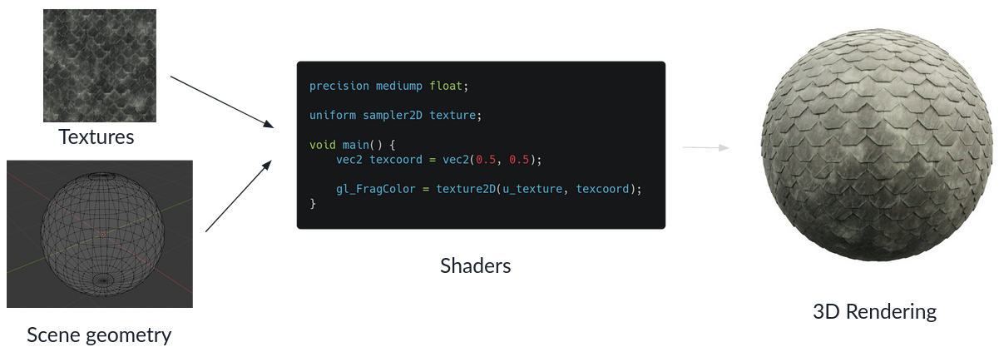
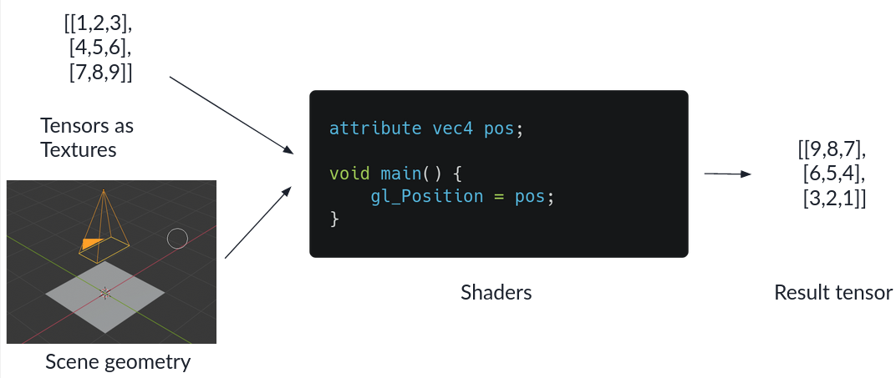

Title: TensorJS - Writing a fast deep learning library for the browser
Date: 2021-09-16 12:09
Modified: 2021-09-16 12:09
Category: Machine learning
Tags: deep-learning, javascript
Slug: tensorjs
Authors: Frithjof Winkelmann
Summary: During the lockdown in spring of 2021 I wrote a deep learning library for the web. Here's what I learned.
Todos: 

When I build [Detext](https://detext.haskai.de/client/), I was looking for deep learning libraries for the browser.
The main 2 options where

- [Onnx.JS](https://github.com/microsoft/onnxjs), developed by Microsoft but not actively maintained at the time
- [TensorFlow.js](https://www.tensorflow.org/js), which is pretty mature and well maintained by facebook, but uses its own storage format for
  trained networks. Converting a trained Pytorch model to this format proved to be very challenging at the time.

So, what do you do when there's no viable inference library for executing your
PyTorch/ONNX model? You write your own library of course.
The requirements that I had for this library specifically where:

- Fast execution of reasonably sized models on most hardware and browsers. For me, reasonably
  sized meant a MobileNet on the harware that I had access to - a pretty shitty
  laptop and a Okish mobile phone.
- A "low level" PyTorch like interface for doing computations with tensors - eg.
  being able to do something like
    `const a = new Tensor([1,2,3,4,5,6], {shape: [2,3]}); const b = new Tensor([1,2,3,4,5,6], {shape: [3,2]}); a.matmul(b);`
  I wanted to have this, so that the pre- and postprocessing that most models
  typically need could be done as fast as executing the model itself.
- A "high level" interface for executing models stored in the ONNX format.

In this article I want to go over some of the development challenges that I encountered when
I wrote this library. You can find it on [Github](https://github.com/Hoff97/tensorjs)
and install it from [NPM](https://www.npmjs.com/package/@hoff97/tensor-js).

# Tensors and how they are layed out in memory

Deep learning frameworks are centered around the concept of a tensor - which to us computer programmers is
basically a multidimensional array. Consider a multi dimensional array/tensor like the following one:

```
[[[1,2,3,4],
  [5,6,7,8],
  [9,10,11,12]],
  
 [[13,14,15,16],
  [17,18,19,20],
  [21,22,23,24]]]
```

This tensor has 3 dimensions, which we call its "rank". The dimensions have a length of
`[2,3,4]` respectively, which we summarize as the tensors shape. The simplest layout
to store tensors in memory is called the contiguous layout - which basically
just stores the values in the order that you specify them, together with the shape of the tensor.

This layout allows you to have zero-copy reshapes of tensors, but not much else.
While there is also the strided layout that allows you to have zero copy
transpose and range selection operations, I chose to go with the contiguous layout,
since its easy to implement.

# Execution backends on the Web

While tensor operations are very straightforward to implement in Javascript, these implementations
will not be fast enough to execute any reasonably sized model.
Luckily there are other options for fast code execution:

- [Webassembly](https://webassembly.org/), a binary instruction format that can give you faster runtime than simple 
  Javascript - if optimized sufficiently.
- [WebGL](https://en.wikipedia.org/wiki/WebGL), a Javascript API intended for 2D and 3D rendering.

## Webassembly

Webassembly (WASM) by now is supported by all major browsers. While you can in principle handwrite Webassembly
in the [WAT format](https://developer.mozilla.org/en-US/docs/WebAssembly/Understanding_the_text_format),
I chose to use Rust. Compiling to WASM is pretty well supported and
[wasm-bindgen](https://github.com/rustwasm/wasm-bindgen) even generates the JS boilerplate code
for calling into WASM, and corresponding Typescript Type definitions for you.
With this writing the WASM backend was way simpler than expected.

## WebGL

WebGL was originally intended for 2D and 3D visualizations accelerated by GPUs.
So how do you abuse this API to implement fast tensor operations?

The traditional pipeline in WebGL looks a bit like this:



You feed the geometry of the scene and textures to the vertex and fragment shaders.
The vertex shader determines the position of all vertices on the screen, while
the fragment shader determines the color of each pixel on the screen - typically
using the textures.

By setting up a very simple scene geometry of a single rectengular plane
that fills up the whole screen, you can use the textures as
your input tensors and treat the rendered output as the result tensor.



Doing this allows you to implement many operations by simply writing the correct
fragment shader.

There is one detail that I'm going over here - which is the conversion of tensors
to textures and back. For this you

1. Represent the tensor in the contiguous layout
2. Create a texture of fitting height and width. If the tensor has a size that is not conveniently 
   dividable into integer width and height you create a texture that is slightly bigger than needed.
3. You fill the tensor data into the texture pixels row by row. Since each pixel consists of
   4 floating point values for the red, green, blue and transparent component, you only need
   1/4th of the pixels of the size of your tensor.

In the fragment shader you of course also have to do this conversion between tensor indices
and texture coordinates.

### Considerations for fast speed

TODO: talk about precompiling shaders, keeping all data on GPU

# Features of TensorJS

## ONNX support

TODO: List of supported operators

## Automatic differentiation

TODO: Quickly talk about graph representation

## Optimizers and models

TODO: How do optimizers discover model parameters

## Sparse tensors

TODO: Short explanation of sparse tensors

# Example applications

TODO: Mobilenet inference, style transfer, on device model finetuning

# Possible extensions